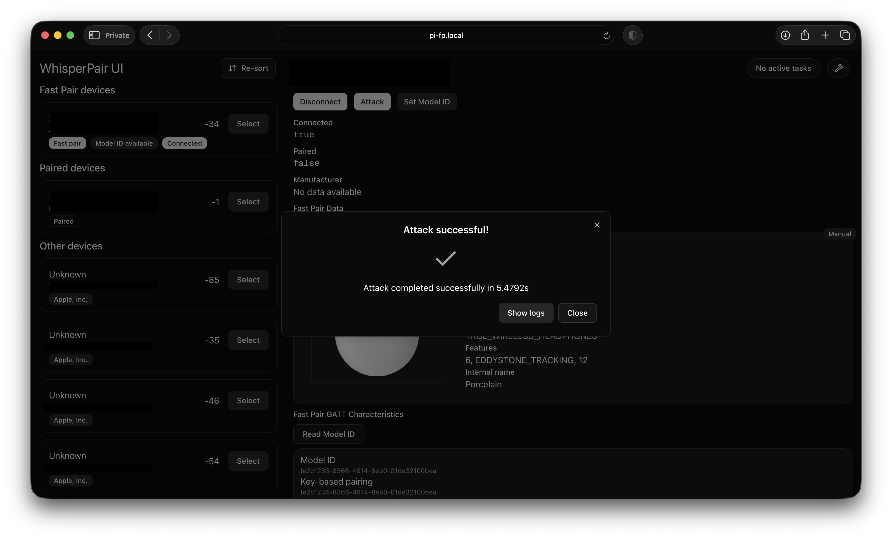

# WhisperPair Testing Harness

This repository contains the artefact for the paper "One Tap to Hijack Them All: A Security Analysis of the Google Fast Pair Protocol", which will appear at IEEE S&P 2026.

## Disclaimer and Responsible Use

The materials are provided to enable reproducibility of our evaluation and to assist researchers in performing defensive testing. Use these materials only for authorized security research and defensive verification on devices you own or have explicit permission to test. As the code in this repository demonstrates vulnerabilities in consumer accessories, do not use it to attack third-party devices without clear written permission. The authors performed all experiments on devices owned by the project team or donated with informed consent. By running these tools you agree to use them only for defensive research, reproduction of our results, or device self-testing.

## Setup and Requirements

> [!NOTE]
> **Summary:** ensure that you have a Linux machine with a Bluetooth adapter, and that Node.js (LTS) and pnpm are installed.  
> You can run both the UI and server on the same machine by running `bash build.sh` followed by `bash start.sh`.

This repository contains a testing harness for evaluating whether a target device correctly implements certain security requirements of Google Fast Pair.
The harness can test whether the pairing state predicate is correctly implemented, whether messages with reused nonces are rejected, and whether the device is vulnerable to an invalid curve attack.
The harness consists of a backend server and a frontend web UI.

> [!NOTE]
> If you're looking for the implementation of the attacks specifically:
> [`./toolkit-server/src/fast-pair-service.ts`](./toolkit-server/src/fast-pair-service.ts) and [`./toolkit-server/src/protocol.ts`](./toolkit-server/src/protocol.ts) contain the implementation of the attacks and the Fast Pair protocol.

The toolkit consists of two components: the [server](./toolkit-server/) and the [UI](./toolkit-ui/).  
The server needs to be run on a Linux system, and has been tested with a Raspberry Pi 4.  
The UI is a Next.js frontend that can be used to control the server, and it can run anywhere Node.js is supported.
The UI must be able to connect to the server over the network.

We tested the harness with Raspberry Pi OS Lite (64-bit) (6.12.47+rpt-rpi-v8), BlueZ version 5.82.

### Prerequisites

A Linux machine with [BlueZ](https://www.bluez.org), [Node.js](https://nodejs.org/en/download), and [pnpm](https://pnpm.io/installation) installed.

#### Node.js

We highly recommend using the current Long-Term-Support (LTS) version of Node.js (v24.14.0).  
We have ensured that the toolkit works using this version.
Older versions may work up to v18, but older versions will likely crash or produce unexpected results.

##### `nvm.sh`

If you use [nvm](https://github.com/nvm-sh/nvm/tree/master) to manage your installed Node.js versions, you have to make sure that `root` has access to the `nvm`-managed Node.js version as well.  
As explained in [this StackOverflow post](https://stackoverflow.com/a/40078875), you might need to create a new symbolic link.

```bash
# Source - https://stackoverflow.com/a/40078875
# Posted by SimpleJ, modified by community. See post 'Timeline' for change history
# Retrieved 2026-03-30, License - CC BY-SA 4.0

sudo ln -s "$NVM_DIR/versions/node/$(nvm version)/bin/node" "/usr/local/bin/node"
sudo ln -s "$NVM_DIR/versions/node/$(nvm version)/bin/npm" "/usr/local/bin/npm"
sudo ln -s "$NVM_DIR/versions/node/$(nvm version)/bin/npx" "/usr/local/bin/npx"
```

> [!NOTE]
> To run the server, you only need to link `node`.

If Node.js is also installed using an external package manager, the version available to `sudo` may be different from the one used by `nvm`.  
You can check this by comparing the output of `node -v` and `sudo node -v`.  
While we recommend Node.js LTS v24, the server should be able to function correctly up until v18.

##### `pnpm`

If Node.js v24 LTS is installed, you should be able to enable `pnpm` using the following command:

```bash
corepack enable
```

#### Additional tooling

The harness also requires `hcitool` and `l2ping`.  
Depending on your Linux distribution, `hcitool` might not be available. You might have to install `bluez-deprecated-tools`.  
It remains preinstalled on the latest Raspberry Pi OS Lite version at the time of writing. (1 Oct 2025)

If the Bluetooth adapter is not powered on, the server will attempt to use `rfkill` to turn it on.  
Testing the Audio Switch extension requires `rfcomm`.

> [!NOTE]
> The server will check for the availability of these tools on startup.
> Additional information about features that may not be available will be displayed in the console.

Reproducing the results requires physical access to a vulnerable device.  
Beware that most vendors have released software updates for WhisperPair, so you may need devices with outdated firmware.  
See [Selecting a device](#selecting-a-device) for more information on what devices we used in our evaluation.

### Quick Setup

If you want to run the UI and server on the same (Linux) machine, you can use the `build.sh` and `start.sh` scripts.  
First, install the required dependencies and build the components using:

```bash
bash build.sh
```

Ensure Bluetooth is enabled:

```bash
sudo rfkill unblock bluetooth
```

Then, run the UI and the server using:

```bash
bash start.sh
```

The UI should now be reachable at [http://localhost:3000](http://localhost:3000).

### Running the UI and server on different hosts

You can run the UI and server on different hosts.  
This allows you to run the server on a Linux machine, while the UI runs locally.  
Although this isn't recommended, you can do this as follows:

1. Make sure the `toolkit-server` directory is available on the Linux machine
2. Build the `toolkit-server` by running `bash build.sh`
3. Update the `.env` file in the `toolkit-ui` directory so the `SERVER_URL` variable is set to the server URL.
   You can run `bash update_server_url.sh <YOUR_URL>` to update the .env file automatically.
4. Build the `toolkit-ui` by running `bash build.sh`
5. Start the `toolkit-server` by running `bash start.sh`
6. Start the `toolkit-ui` by running `bash start.sh`

The UI should now be reachable at [http://localhost:3000](http://localhost:3000).

### Manual Server Setup

As an alternative to using the `build.sh` and `start.sh` scripts, you can also build and start the server manually.
Detailed instructions on how to perform these steps are located in the [`toolkit-server` README](./toolkit-server/README.md)

### Manual UI Setup

As an alternative to using the `build.sh` and `start.sh` scripts, you can also build and start the UI manually.
Detailed instructions on how to perform these steps are located in the [`toolkit-ui` README](./toolkit-ui/README.md)

## Usage

### Selecting a device

You need to have a Fast Pair-compatible accessory to perform the attacks and use the toolkit.  
We evaluated 25 devices from 16 vendors, shown in the table below.
If you have one of those devices, and their firmware has not been updated since September 2025, you can reproduce our results.

You can also use the toolkit to evaluate a device that we did not test.  
However, you may run into some unexpected errors depending on the reliability of the Bluetooth chipset of the target device.

When performing the attacks, ensure that you know whether the target device is in pairing mode or not.  
Some attacks require the device _not_ to be in pairing mode, and may produce false positives otherwise.  
Other attacks require the device to be in pairing mode, and may not work otherwise.

If you're looking for Fast Pair-compatible devices, you can use the [Model IDs list](./model_ids.csv) to view all Fast Pair-certified devices.

#### `Model not included in test set` warning message

The UI will display a warning message if you have selected a device that was not included in our test set.  
This message is shown based on the Model ID, which can vary across different colours and regions for the same device.  
For example, a pair of blue Sony WH-1000XM6 headphones uses a different Model ID than a pair of black Sony WH-1000XM6 headphones.

Since it is likely that these devices will have the same firmware (even though their Model IDs are different), you can safely ignore this warning message.

#### `No device with Model ID <number> was found` error message

Due to stricter rate limiting enforced by the Fast Pair gRPC API, some requests for model data may return successful responses with empty bodies.
This will cause the UI to display `No device with Model ID <number> was found`.  
If you are certain that the Model ID you entered exists, please wait a few minutes and retry.

> [!NOTE]
> Model data for the devices in our test set are included in this repository and will be read from a cache.
> Evaluating these devices does not require an API call to the gRPC service.
> Note that devices of the same series may not have the same Model IDs. See [Model not included in test set warning message](#model-not-included-in-test-set-warning-message) for more information.

### UI Manual



The UI will attempt to connect to the server on startup.  
When the connection is successful, a "Connected to the server" message will be displayed in the bottom right corner of the screen.

Evaluating whether a device is vulnerable requires three steps: discovering the device, settings its Model ID, and running an attack.

#### 1. Discovering devices

The harness continuously scans for Bluetooth Low Energy devices, which are displayed on the left-hand side of the screen.
Devices advertising Fast Pair data are shown on top.
Device details are shown on the right-hand side of the screen after clicking "Select" on a device.

#### 2. Setting a Model ID

Running the tests described in the paper requires a Model ID to be set for a device.
If the device exposes the Fast Pair GATT characteristic, a "Read Model ID" button will be shown in the device details.
Clicking this button will attempt to read the Model ID.

Note that many devices do not correctly implement this characteristic, returning invalid Model IDs.
Alternatively, you can manually set the device's Model ID by pressing the "Set Model ID" button and entering a value manually.
Devices that were evaluated during our tests can be selected, or a custom value can be entered.
A complete list of Fast Pair compatible devices is included in the root of this repository.

Once a Model ID has been set, metadata about the device will be shown in the device details.

#### 3. Running an attack

To run an attack, click the "Attack" button in the device details pane.
There are three implemented attacks: pairing state predicate enforcement, nonce reuse, and an invalid curve attack.
If you are already connected to a device, checking the "Reconnect" box will disconnect and reconnect to the device before performing the attack.

The pairing state predicate enforcement check offers some additional configuration options:

- **Switch back**: Attempts to switch back to the original host using the Audio Switch functionality, if supported.
- **Bond**: Performs a BR/EDR pairing if the pairing state predicate is not enforced.
- **Write account key**: Writes a (hardcoded) account key after the pairing procedure.

While an attack is in progress, logs will be shown in real-time in the UI.
After the attack has been completed, its duration will be displayed.

#### Task management

Sometimes, an attack or pairing may take longer than expected.  
You can cancel an attack or pairing by clicking the "Cancel" button in the corresponding dialog.
If you reloaded the UI during an attack or pairing, you can use the task manager to cancel instead.

In the top right-hand side of the screen, the second button from the right will display the task status.
If no tasks are active, it will display "No active tasks".
Otherwise, it will say "Task in progress".
To cancel a task, click the "Task in progress" button, then press the "Cancel" button.

If the server hangs due to a pending task that can't be cancelled, try [resetting the Bluetooth adapter](#troubleshooting).

> [!NOTE]
> Tasks may take up to 20 seconds to cancel.

#### Troubleshooting

In some cases, the Bluetooth adapter may get "stuck" in a "bad state".
The easiest solution to this problem is resetting the Bluetooth adapter.
To perform a reset, open the troubleshooting menu by pressing the wrench icon on the top right-hand side of the screen.
Then, select "Reset BLE adapter" and confirm the reset by clicking "Reset" in the dialog.

If a fatal error occurs and the server has to shut down, the `start.sh` script will automatically restart the server.

In scenarios with a lot of nearby BLE devices, the server may unexpectedly close due to a D-Bus error.
This happens very rarely, and the `./start.sh` script should automatically restart the server if this happens.

## Results and evaluated devices

| _Manufacturer_ | _Device name_      | _Model ID_ | _Vulnerable to hijack_ | _Time-to-hijack (s)_ | _Vulnerable to nonce reuse_ | _Vulnerable to invalid curve attack_ |
| -------------- | ------------------ | ---------- | ---------------------- | -------------------- | --------------------------- | ------------------------------------ |
| Apple          | Beats Solo Buds    | 6980580    | No                     |                      | Yes                         | No                                   |
| Google         | Pixel Buds Pro 2   | 12934265   | Yes                    | 6.89                 | No                          | No                                   |
| Jabra          | Elite 8 Active     | 3778746    | Yes                    | 32.01                | No                          | No                                   |
| JBL            | Tune Beam          | 3293323    | Yes                    | 6.91                 | Only in same session        | No                                   |
| Marshall       | MOTIF II A.N.C.    | 15473012   | Yes                    | 9.49                 | Yes                         | No                                   |
| Nothing        | Ear (a)            | 8625818    | Yss                    | 38.80                | Only in same session        | No                                   |
| OnePlus        | Nord Buds Pro 3    | 13394952   | Yes                    | 10.19                | Only in same session        | No                                   |
| HP             | Poly VFree 60      | 15984097   | No                     |                      | No                          | No                                   |
| Redmi          | Buds 5 Pro         | 11155060   | Yes                    | 8.32                 | Only in same session        | No                                   |
| Soundcore      | Liberty 4 NC       | 5409858    | Yes                    | 15.27                | Yes                         | No                                   |
| Sony           | WF-1000XM5         | 12499626   | Yes                    | 9.43                 | Yes                         | No                                   |
| Audio-Technica | ATH-M20xBT         | 13285048   | No                     |                      | Only in same session        | No                                   |
| Bose           | QuietComfort Ultra | 5723549    | No                     |                      | No                          | No                                   |
| JBL            | Live 775 NC        | 14502233   | Yes                    | 7.62                 | Only in same session        | No                                   |
| Marshall       | Major V            | 12915160   | Yes                    | 11.70                | Only in same session        | No                                   |
| Sonos          | Ace V              | 7340495    | No                     |                      | No                          | No                                   |
| Sony           | WH-1000XM4         | 13386638   | Yes                    | 9.69                 | Yes                         | No                                   |
| Sony           | WH-1000XM5         | 13911719   | Yes                    | 12.38                | Yes                         | No                                   |
| Sony           | WH-1000XM6         | 6360443    | Yes                    | 12.94                | Only in same session        | No                                   |
| Sony           | WH-CH720N          | 16003068   | Yes                    | 7.46                 | Yes                         | No                                   |
| Bang & Olufsen | Beosound A1        | 2431472    | No                     |                      | No                          | No                                   |
| Jabra          | Speak2 55 UC       | 9888885    | No                     |                      | No                          | No                                   |
| JBL            | Clip 5             | 1917389    | Yes                    | 36.19                | Yes                         | No                                   |
| JBL            | Flip 6             | 7278954    | No                     |                      | No                          | No                                   |
| Logitech       | Wonderboom 4       | 11575855   | Yes                    | 11.96                | Only in same session        | No                                   |

If you're looking for Fast Pair-compatible devices, you can use the [Model IDs list](./model_ids.csv) to view all Fast Pair-certified devices.
